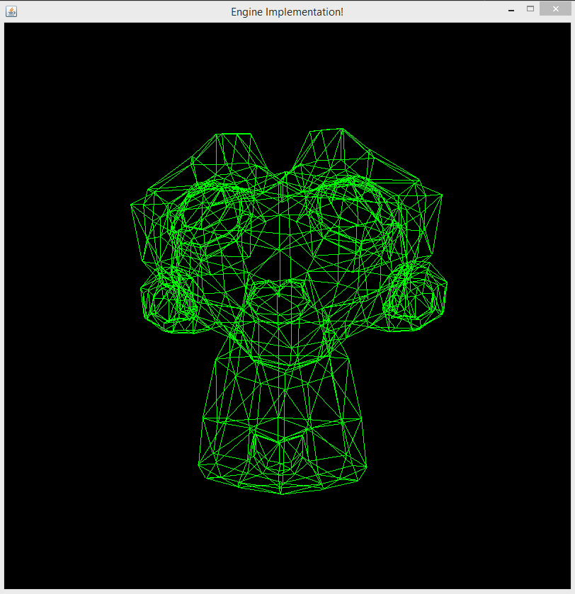
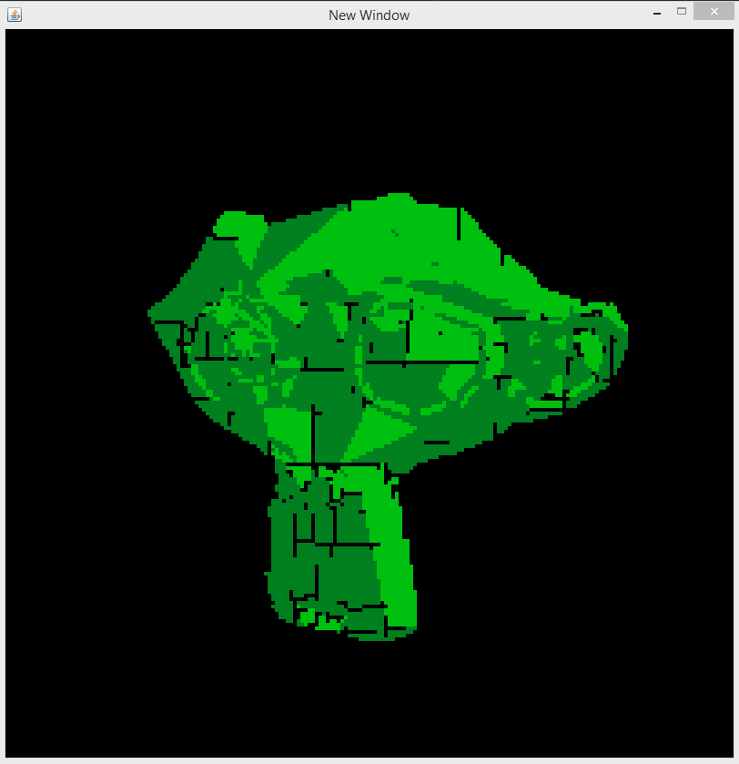
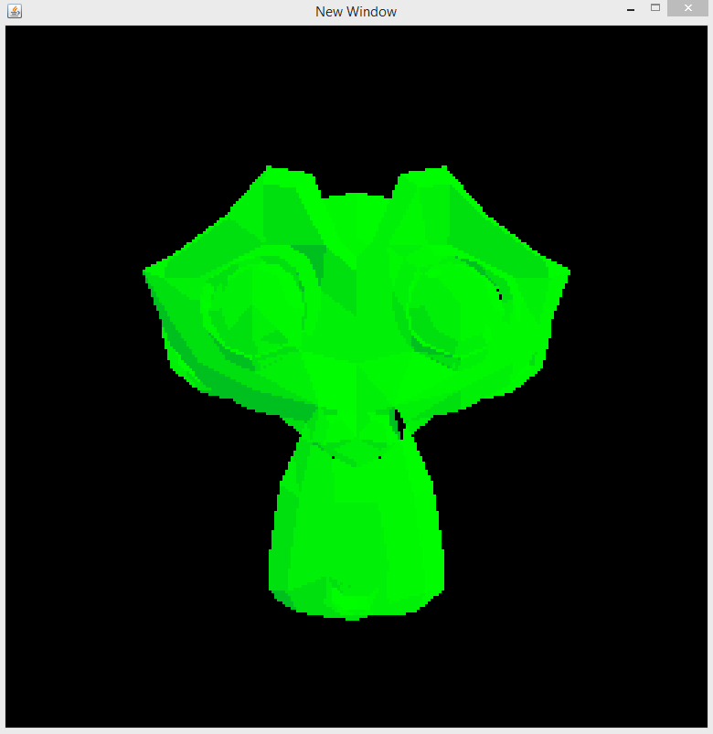
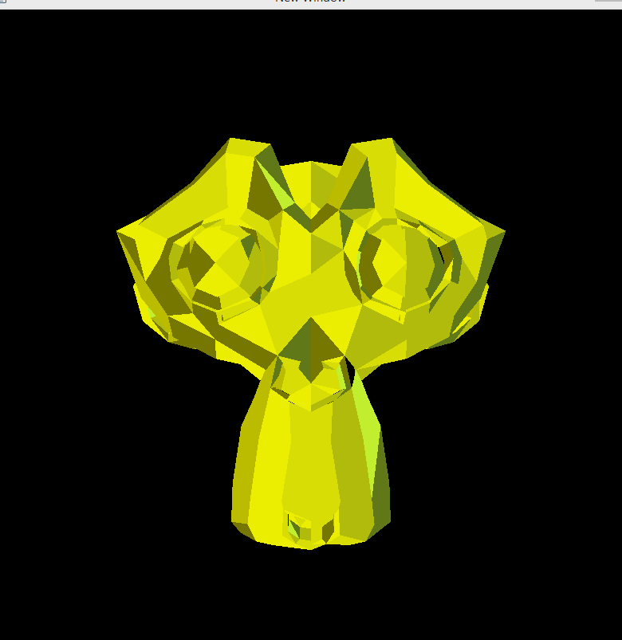
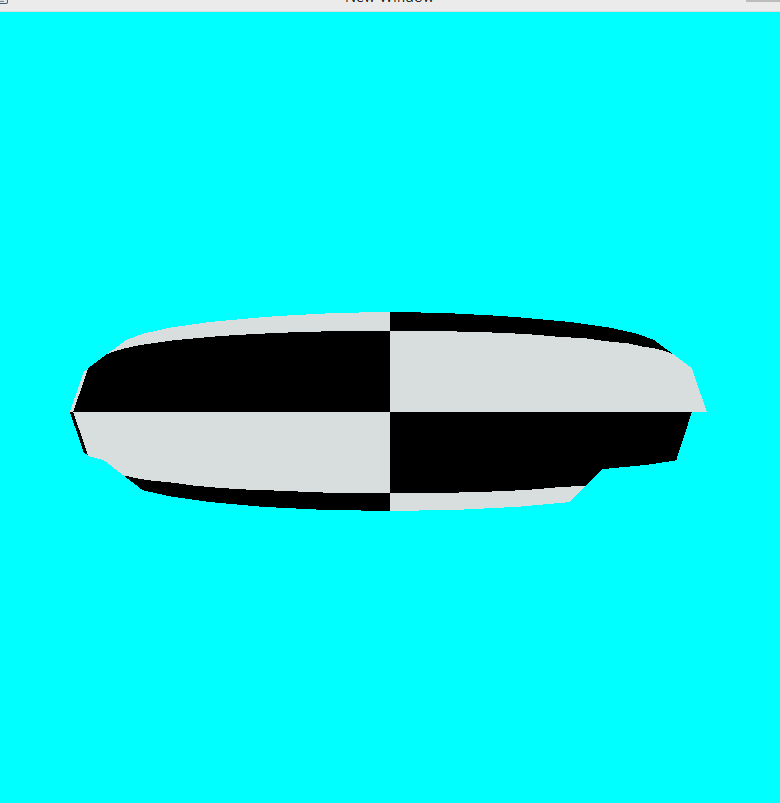

# PixelVision
Simple Java Visual Framework used for visualization

Here is a short timeline of production up to the current stage:

Basic wireframe loading:

Basic triangle rasterizing:

ZBuffering:

Cleaner rasterizing and basic shading:

Affine texture mapping:

Gouraud shading:

